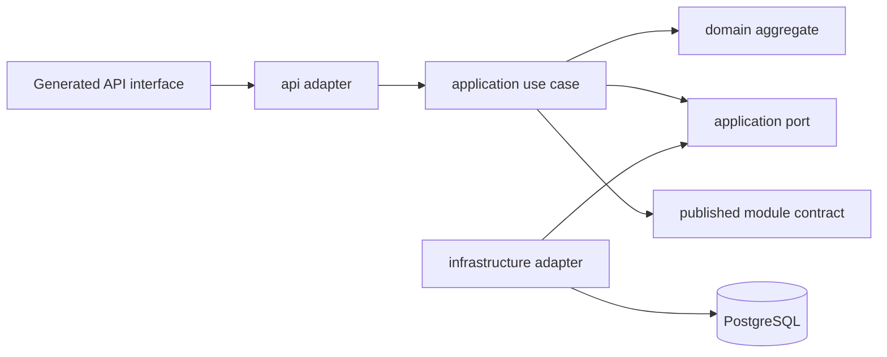
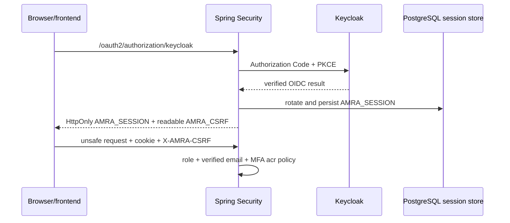
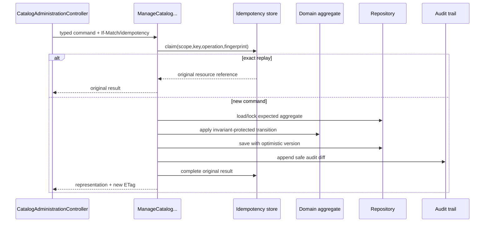

# Developer guide: amra-merch-market-backend

Статус: руководство для onboarding и ежедневной разработки.

Обновлено: 19 августа 2026 года.

## 1. Для кого и как читать

Этот документ предназначен для разработчика, который впервые открыл backend «Амра Шоп» и должен безопасно выполнять feature-задачи. После чтения разработчик должен уметь:

- локально поднять инфраструктуру и приложение;
- найти HTTP-контракт, use case, domain rule и persistence adapter;
- проследить public/admin catalog и inventory-команды от HTTP до PostgreSQL;
- объяснить transaction, locking, idempotency, ETag, audit и error semantics;
- добавить новый endpoint или изменить domain rule без нарушения границ;
- выбрать подходящий уровень теста и пройти обязательные quality gates;
- подготовить логический commit с актуальной документацией.

Рекомендуемый порядок первого чтения:

1. этот guide;
2. [ENGINEERING_CHARTER](ENGINEERING_CHARTER.md) — обязательные инженерные правила;
3. [DECISION_REGISTER](DECISION_REGISTER.md) — принятые и отложенные решения;
4. [SYSTEM_CONTEXT](architecture/SYSTEM_CONTEXT.md) — граница системы и внешние участники;
5. ADR нужного модуля: [catalog ADR-0006](adr/0006-catalog-api-boundaries.md) или [inventory ADR-0007](adr/0007-inventory-consistency-boundaries.md);
6. requirements и invariants конкретного vertical slice.

`AGENTS.md`, четыре основных проектных MD и документация изменяемого модуля являются частью Definition of Done. При расхождении документа и кода нельзя молча выбирать удобный вариант: расхождение исправляется в той же feature-ветке или оформляется новым решением.

## 2. Текущее состояние продукта

Полностью реализованы:

- platform foundation: discovery, trace ID, RFC 9457 errors, OpenAPI generation;
- identity/access foundation: Keycloak OIDC, server-side JDBC session, CSRF, CORS, RBAC, MFA policy;
- catalog vertical slice: categories, products, variants, media metadata, collections, public list/detail и protected administration;
- inventory vertical slice: balances, physical movement ledger, reservations, availability, warehouse administration, expiry worker и audit.

Следующие top-level packages пока являются зарезервированными модульными границами, а не готовой бизнес-функциональностью:

- `customer`, `cart`, `pricing`, `ordering`, `administration`, `outbox`.

Следующий разрешённый этап всегда определяется в [PROJECT_STATUS](PROJECT_STATUS.md), а не по наличию package.

Отдельный frontend пока не интегрирован: product/profile data остаются fixtures, а cart/favorites — device-local `localStorage`. Фактические blockers и последовательность замены описаны в [аудите контекста](integration/CONTEXT_AUDIT.md) и [плане frontend/backend-интеграции](integration/FRONTEND_BACKEND_INTEGRATION_PLAN.md). Наличие готового Catalog/Inventory API не означает готовность profile, price, cart или checkout flows.

## 3. Технологический baseline

| Область | Выбор | Причина |
| --- | --- | --- |
| Runtime | Java 25 | virtual threads, современный язык и утверждённый toolchain |
| Web | Spring MVC | blocking JDBC/JPA workload; WebFlux/R2DBC намеренно не используются |
| Framework | Spring Boot 4.1.0 | зафиксированная initial version; upgrade — отдельная maintenance-ветка |
| Build | Gradle 9.6.1, Kotlin DSL | wrapper, locking, reproducible archives |
| Architecture | modular monolith, Spring Modulith | строгие границы без преждевременных микросервисов |
| Persistence | PostgreSQL 18.4, Flyway, JPA + JDBC | PostgreSQL — source of truth; SQL применяется там, где важны plan/lock/projection |
| API | OpenAPI 3.0.3 contract-first | Java transport и TypeScript client генерируются из одного дерева |
| Security | Keycloak OIDC + backend session | browser не получает access/refresh tokens |
| Tests | JUnit 6, AssertJ, jqwik, ArchUnit, Testcontainers | реальные invariants, PostgreSQL semantics и module boundaries |
| Delivery | pinned multi-stage Docker, distroless non-root | immutable container и минимальная runtime surface |

Версии находятся в [`build.gradle.kts`](../build.gradle.kts), [`gradle-wrapper.properties`](../gradle/wrapper/gradle-wrapper.properties) и lock/verification metadata. Не обновляйте их попутно с feature.

## 4. Быстрый локальный старт

### 4.1 Требования

- JDK 25;
- Docker daemon для PostgreSQL/Testcontainers и container gates;
- Git;
- системный Gradle не нужен.

Проверка:

```shell
java -version
./gradlew --version
docker version
```

### 4.2 Полный local stack

```shell
cp .env.example .env
# Заменить все placeholder passwords и OIDC secret.
docker compose up -d postgres keycloak-postgres keycloak
set -a && . ./.env && set +a
./gradlew bootRun
```

По умолчанию:

- backend: `http://localhost:8080`;
- frontend origin в CORS: `http://localhost:3001`;
- Keycloak: `http://localhost:8081`;
- health: `GET /actuator/health`;
- discovery: `GET /api/v1/`.

Local realm не содержит production-пользователей. Keycloak import — bootstrap, не backup и не reconciliation mechanism.

Этот раздел поднимает backend infrastructure и приложение. Он ещё не является полным storefront workflow: local identity provisioning, demo seed/media и frontend generated-client wiring входят в отдельный [integration plan](integration/FRONTEND_BACKEND_INTEGRATION_PLAN.md).

### 4.3 Минимальная проверка без ручного запуска

```shell
./gradlew clean qualityGate
```

Команда требует Docker, потому что integration tests используют настоящий PostgreSQL через Testcontainers. H2 намеренно отсутствует.

## 5. Карта repository

```text
src/main/java/ru/amra/market/
  platform/          общие runtime/API механизмы
  identityaccess/    OIDC, session, CSRF, roles, authorization
  catalog/           catalog module
    api/              inbound HTTP adapters
    application/      use cases, transactions, ports
    domain/           framework-free aggregates/invariants
    infrastructure/   JPA/JDBC/media/audit adapters
  inventory/         inventory module с той же раскладкой

src/main/openapi/    canonical modular OpenAPI contract
src/main/resources/db/migration/  manual Flyway SQL
src/test/java/       unit, property, architecture, contract, integration, acceptance
config/              Checkstyle и OpenAPI templates
ci/                  локально вызываемые CI policy scripts
database/bootstrap/  создание DB roles/schema для local PostgreSQL
identity/keycloak/   local realm bootstrap
docs/                requirements, ADR, guides, runbooks и status
```

Generated Java и TypeScript не редактируются:

- Java: `build/generated/openapi/java`;
- TypeScript: `build/generated/openapi/typescript`;
- source ZIP: `build/distributions/amra-shop-api-client-<version>.zip`.

## 6. Архитектурная модель

### 6.1 Модульный монолит

Top-level package — Spring Modulith module. [`ModularityTests`](../src/test/java/ru/amra/market/architecture/ModularityTests.java) проверяет обнаруженные модули и cycles. [`LayerDependencyRulesTests`](../src/test/java/ru/amra/market/architecture/LayerDependencyRulesTests.java) защищает направление зависимостей.



Разрешённое направление:

- `api → application → domain`;
- `infrastructure → application port/domain`;
- domain не знает Spring, HTTP, OpenAPI, JPA и JDBC;
- один модуль вызывает другой только через опубликованный application contract;
- прямое использование чужой repository/table модели запрещено.

### 6.2 Что означает port

Port нужен, когда application-слою требуется внешняя способность: загрузить aggregate, взять lock, сгенерировать ID, прочитать security context или записать audit. Например:

- [`InventoryStockRepository`](../src/main/java/ru/amra/market/inventory/application/port/InventoryStockRepository.java) задаёт atomic stock persistence contract;
- [`JdbcInventoryStockRepository`](../src/main/java/ru/amra/market/inventory/infrastructure/persistence/JdbcInventoryStockRepository.java) реализует его PostgreSQL SQL;
- [`CatalogVariantInventoryView`](../src/main/java/ru/amra/market/catalog/application/integration/CatalogVariantInventoryView.java) — опубликованная catalog-граница для проверки active variants.

Не создавайте port для чистого вычисления или ради интерфейса «на будущее». Он оправдан только реальной boundary, заменяемым adapter или тестируемой orchestration dependency.

### 6.3 Где проходят транзакции

`@Transactional` ставится на application use case, а не на controller/domain:

- public query — `readOnly=true`;
- command — одна транзакция, содержащая state mutation, idempotency result, ledger/event и audit;
- внешний network call не должен удерживать DB transaction.

Основные transaction owners:

- catalog: [`ManageCatalogCategories`](../src/main/java/ru/amra/market/catalog/application/ManageCatalogCategories.java), [`ManageCatalogProducts`](../src/main/java/ru/amra/market/catalog/application/ManageCatalogProducts.java), [`ManageCatalogCollections`](../src/main/java/ru/amra/market/catalog/application/ManageCatalogCollections.java);
- inventory: [`ManageInventoryStock`](../src/main/java/ru/amra/market/inventory/application/ManageInventoryStock.java), [`ManageWarehouseInventory`](../src/main/java/ru/amra/market/inventory/application/ManageWarehouseInventory.java), [`ManageInventoryReservations`](../src/main/java/ru/amra/market/inventory/application/ManageInventoryReservations.java), [`ExpireInventoryReservations`](../src/main/java/ru/amra/market/inventory/application/ExpireInventoryReservations.java).

## 7. HTTP contract и generated code

Canonical root — [`src/main/openapi/openapi.yaml`](../src/main/openapi/openapi.yaml). Paths и schemas разнесены по `$ref`, но являются единым contract tree.

Workflow изменения API:

1. изменить path/schema/parameter/response в `src/main/openapi`;
2. проверить все local `$ref`;
3. выполнить `./gradlew openApiValidate checkOpenApiCompatibility`;
4. сгенерировать transport: `./gradlew generateJavaApi`;
5. реализовать generated interface в `api` adapter;
6. добавить contract/security/error tests;
7. проверить TypeScript artifact.

Controllers реализуют generated interfaces напрямую:

- [`CatalogApiController`](../src/main/java/ru/amra/market/catalog/api/CatalogApiController.java) → `CatalogApi`;
- [`CatalogAdministrationController`](../src/main/java/ru/amra/market/catalog/api/CatalogAdministrationController.java) → `CatalogAdministrationApi`;
- [`InventoryApiController`](../src/main/java/ru/amra/market/inventory/api/InventoryApiController.java) → `InventoryApi`;
- [`InventoryAdministrationController`](../src/main/java/ru/amra/market/inventory/api/InventoryAdministrationController.java) → `InventoryAdministrationApi`.

Generated DTO — только transport. Их нельзя передавать в domain и тем более сохранять как JPA entity. Controller преобразует DTO в command/value objects и обратно.

### 7.1 Версионирование и compatibility

- major находится в path: `/api/v1`;
- additive compatible change остаётся в v1;
- удаление/переименование field, narrowing enum или изменение semantics требует отдельной оценки и часто нового major;
- `checkOpenApiCompatibility` сравнивает candidate с contract в local `main`.

### 7.2 Ошибки

API failures используют `application/problem+json` по RFC 9457:

- HTTP status отражает protocol semantics;
- `code` — стабильный business/security code для локализации frontend;
- `traceId` связывает ответ, request и audit;
- `violations` содержит structured field errors;
- SQL, stack trace, credentials и internal state наружу не выходят.

Общая обработка находится в catalog [`ApiExceptionHandler`](../src/main/java/ru/amra/market/catalog/api/ApiExceptionHandler.java), inventory [`InventoryApiExceptionHandler`](../src/main/java/ru/amra/market/inventory/api/InventoryApiExceptionHandler.java) и security [`SecurityProblemWriter`](../src/main/java/ru/amra/market/identityaccess/SecurityProblemWriter.java).

## 8. Platform и request tracing

[`RequestTraceFilter`](../src/main/java/ru/amra/market/platform/web/RequestTraceFilter.java):

1. принимает только syntactically bounded `X-Trace-Id`;
2. иначе создаёт новый ID;
3. помещает ID в request-local [`TraceContext`](../src/main/java/ru/amra/market/platform/web/TraceContext.java);
4. возвращает тот же header клиенту;
5. очищает context после запроса.

Audit context providers читают `TraceContext.currentId()`, поэтому mutation и support-visible error можно связать одним ID. Код вне HTTP request должен иметь отдельную явную correlation policy; не подставляйте customer data.

## 9. Identity, session и authorization

Центральная конфигурация — [`SecurityConfiguration`](../src/main/java/ru/amra/market/identityaccess/SecurityConfiguration.java).

Browser flow:



Ключевые правила:

- frontend не получает access/refresh token;
- роли allowlisted в [`AccessRole`](../src/main/java/ru/amra/market/identityaccess/AccessRole.java);
- customer protected API требует `email_verified=true`;
- `/api/v1/admin/catalog/**` требует `CATALOG_MANAGER` или `ADMIN`, verified email и accepted MFA ACR;
- `/api/v1/admin/inventory/**` требует `WAREHOUSE_MANAGER` или `ADMIN`, verified email и MFA;
- unsafe browser method требует CSRF;
- `AMRA_SESSION` HttpOnly; CSRF cookie не является credential;
- session idle/absolute lifetime разделены, absolute limit реализован [`AbsoluteSessionLifetimeFilter`](../src/main/java/ru/amra/market/identityaccess/AbsoluteSessionLifetimeFilter.java).

Подробности: [IDENTITY_ACCESS](security/IDENTITY_ACCESS.md).

## 10. Catalog module

### 10.1 Domain model

Главные aggregates:

- [`Category`](../src/main/java/ru/amra/market/catalog/domain/Category.java): hierarchy identity, slug/name/status/order/version;
- [`CategoryHierarchy`](../src/main/java/ru/amra/market/catalog/domain/CategoryHierarchy.java): cycle, orphan, depth и sibling slug rules;
- [`Product`](../src/main/java/ru/amra/market/catalog/domain/Product.java): content, categories, characteristics, variants, media, collections и lifecycle;
- [`ProductVariant`](../src/main/java/ru/amra/market/catalog/domain/ProductVariant.java): immutable SKU identity и presentation/attributes;
- [`EditorialCollection`](../src/main/java/ru/amra/market/catalog/domain/EditorialCollection.java): ordered product membership.

Lifecycle:

```text
Product: DRAFT -> ACTIVE -> ARCHIVED
Variant: ACTIVE -> ARCHIVED
Category: HIDDEN / ACTIVE
Collection: HIDDEN / ACTIVE / ARCHIVED согласно domain policy
```

Публикация Product разрешена только при active category, active variant и primary media. Полный checklist находится в [CATALOG_INVARIANTS](catalog/CATALOG_INVARIANTS.md).

### 10.2 Public category tree

Chain `GET /api/v1/catalog/categories`:

1. [`CatalogApiController.getCatalogCategories()`](../src/main/java/ru/amra/market/catalog/api/CatalogApiController.java) вызывает use case;
2. [`GetCatalogCategoryTree.execute()`](../src/main/java/ru/amra/market/catalog/application/GetCatalogCategoryTree.java) получает flat visible set;
3. [`JdbcVisibleCategoryReader`](../src/main/java/ru/amra/market/catalog/infrastructure/persistence/JdbcVisibleCategoryReader.java) выполняет bounded recursive query без N+1;
4. use case строит deterministic tree и strong representation ETag;
5. controller возвращает generated DTO и public cache policy.

### 10.3 Public product list

Chain `GET /api/v1/catalog/products`:

1. controller создаёт [`CatalogProductListCriteria`](../src/main/java/ru/amra/market/catalog/application/CatalogProductListCriteria.java) из allowlisted query parameters;
2. [`ListCatalogProducts.execute()`](../src/main/java/ru/amra/market/catalog/application/ListCatalogProducts.java) задаёт 30-day new boundary через injected `Clock`;
3. [`JdbcCatalogProductListReader`](../src/main/java/ru/amra/market/catalog/infrastructure/persistence/JdbcCatalogProductListReader.java) выполняет page/total/variant projection set-based запросами;
4. [`MediaDeliveryUrlProvider`](../src/main/java/ru/amra/market/catalog/application/port/MediaDeliveryUrlProvider.java) превращает private object key в public delivery URL;
5. response получает exact totals, stable UUID tie-breaker и ETag.

Поддерживаются category descendants, active collection, `new`, search, size/color same-variant filters и explicit sort allowlist. Generic query language намеренно отсутствует.

### 10.4 Public product detail и slug redirect

[`GetCatalogProduct.execute()`](../src/main/java/ru/amra/market/catalog/application/GetCatalogProduct.java):

- нормализует requested slug;
- [`ProductRepository.findBySlug()`](../src/main/java/ru/amra/market/catalog/application/port/ProductRepository.java) различает canonical и alias;
- alias active product возвращает `301` на текущий canonical slug;
- draft/archive/missing наружу выглядят одинаково как `404`;
- detail содержит только visible references, ordered media и active variants;
- object storage key, persistence status/version и admin metadata не раскрываются.

### 10.5 Catalog admin command

Обобщённая цепочка create/mutation:



`If-Match` обязателен для изменения существующего resource:

- отсутствует → `428 PRECONDITION_REQUIRED`;
- устарел → `412 STALE_RESOURCE_VERSION`;
- create/replay collision с другим fingerprint → `409`.

### 10.6 Catalog persistence

Catalog использует осознанный mix:

- JPA для aggregate roots Category/Product и optimistic entity version;
- JDBC для сложного Product child state, read projections, recursive/search queries, collections, idempotency и audit.

[`JpaProductRepositoryAdapter`](../src/main/java/ru/amra/market/catalog/infrastructure/persistence/JpaProductRepositoryAdapter.java) композиционно использует root repository, [`ProductChildJdbcStore`](../src/main/java/ru/amra/market/catalog/infrastructure/persistence/ProductChildJdbcStore.java) и mapper. Это не разрешение смешивать JPA/JDBC произвольно: новый SQL adapter должен быть обоснован query shape, locking или projection requirements.

## 11. Inventory module

### 11.1 Quantity model

- `onHand` — физически учтённое количество;
- `reserved` — сумма единиц в active reservations;
- `available = onHand - reserved`;
- invariant: `0 <= reserved <= onHand`;
- quantity — checked `long`, дробные единицы не поддерживаются;
- negative stock, preorder и partial reservation запрещены.

Основной aggregate — [`InventoryBalance`](../src/main/java/ru/amra/market/inventory/domain/InventoryBalance.java). Методы возвращают новый immutable snapshot:

- `receive(...)` → увеличивает `onHand` и создаёт `RECEIPT` movement;
- `reconcile(...)` → приводит `onHand` к exact count, но не ниже active reserved;
- `reserve(...)` → увеличивает только `reserved`;
- `release(...)` → уменьшает только `reserved`;
- `commit(...)` → уменьшает `onHand` и `reserved`, создаёт physical movement.

`InventoryMovement` — immutable physical ledger. Reserve/release/expire не являются physical movements.

### 11.2 Public availability

Chain `GET /api/v1/inventory/availability`:

1. [`InventoryApiController.getInventoryAvailability()`](../src/main/java/ru/amra/market/inventory/api/InventoryApiController.java) принимает 1–60 UUID;
2. [`GetInventoryAvailability.execute()`](../src/main/java/ru/amra/market/inventory/application/GetInventoryAvailability.java) выполняет first-seen de-duplication;
3. catalog boundary одним batch подтверждает active variants;
4. [`JdbcInventoryAvailabilityReader`](../src/main/java/ru/amra/market/inventory/infrastructure/persistence/JdbcInventoryAvailabilityReader.java) одним batch читает available state;
5. unknown/inactive/missing balance становится `OUT_OF_STOCK`;
6. response содержит `asOf`, `Cache-Control: no-store` и не содержит exact quantities.

Этот endpoint — storefront hint, а не checkout guarantee. Будущий ordering повторно резервирует stock в strong-consistency transaction.

### 11.3 Warehouse receipt

Chain `POST .../receipts`:

1. security проверяет session, role, verified email, MFA и CSRF;
2. [`InventoryAdministrationController.receiveInventoryStock()`](../src/main/java/ru/amra/market/inventory/api/InventoryAdministrationController.java) преобразует DTO;
3. [`ManageWarehouseInventory.receive()`](../src/main/java/ru/amra/market/inventory/application/ManageWarehouseInventory.java) получает actor scope, строит canonical fingerprint и claim-ит durable idempotency key;
4. exact replay возвращает original typed result без новой мутации/audit;
5. catalog boundary проверяет active variant;
6. [`ManageInventoryStock.receive()`](../src/main/java/ru/amra/market/inventory/application/ManageInventoryStock.java) lock/create balance, вызывает domain `receive`, сохраняет balance + movement и сверяет ledger total;
7. [`InventoryAuditTrail.record()`](../src/main/java/ru/amra/market/inventory/application/InventoryAuditTrail.java) добавляет allowlisted before/after diff;
8. typed command result и idempotency completion фиксируются в той же transaction;
9. controller возвращает original/new balance, movement и strong ETag.

### 11.4 Physical reconciliation

`ManageWarehouseInventory.reconcile()` отличается:

- требует `If-Match`, разобранный [`InventoryVersionEtag`](../src/main/java/ru/amra/market/inventory/application/InventoryVersionEtag.java);
- lock-ит существующий balance;
- сравнивает expected version;
- exact target не может быть ниже reserved;
- zero delta отклоняется как `INVENTORY_NO_CHANGE`;
- signed adjustment movement сохраняет равенство `onHand = sum(physical movements)`.

### 11.5 Reservation lifecycle

Published contract — [`InventoryReservationOperations`](../src/main/java/ru/amra/market/inventory/application/contract/InventoryReservationOperations.java). Он предназначен для будущего ordering module и принимает opaque owner UUID, а не customer PII.

Domain aggregate [`InventoryReservation`](../src/main/java/ru/amra/market/inventory/domain/InventoryReservation.java):

```text
                 extend once
              +--------------+
              |              v
CREATE -> ACTIVE ----------> ACTIVE
             |  \             |
             |   \            |
          commit release     expire
             |      |          |
             v      v          v
        COMMITTED RELEASED   EXPIRED
```

Rules:

- default TTL 15 минут;
- 1–100 normalized lines;
- duplicate lines агрегируются checked addition;
- одна strict extension считается от предыдущего deadline;
- только один terminal transition;
- commit/extend после deadline запрещены, даже если worker ещё не записал `EXPIRED`.

### 11.6 Создание reservation

[`ManageInventoryReservations.create()`](../src/main/java/ru/amra/market/inventory/application/ManageInventoryReservations.java):

1. нормализует typed lines и owner scope;
2. durable claim idempotency;
3. batch-проверяет active variants;
4. сортирует keys `(warehouse_id, variant_id)`;
5. `lockOrCreateAll` берёт rows в одном deterministic порядке;
6. проверяет availability каждой line до commit transaction;
7. сохраняет все reserved snapshots;
8. создаёт reservation root, lines, `CREATED` event и typed replay result;
9. завершает idempotency.

Любая недостаточная line откатывает весь набор. Единый порядок locks предотвращает deadlock при reversed input.

### 11.7 Commit, release и replay

Общий private orchestration method `ManageInventoryReservations.transition(...)`:

- claim-ит `(owner,key,operation,fingerprint)`;
- replay читает immutable typed snapshot исходного command result;
- lock-ит reservation root;
- проверяет owner и domain transition;
- lock-ит balance rows deterministic order;
- commit создаёт reservation-bound outgoing movements;
- release меняет только reserved;
- сохраняет event/result и завершает idempotency.

Идемпотентность — не `try/catch unique violation` вокруг business logic. Tables хранят scope, operation, fingerprint, state и original result reference; тот же key с другим payload отклоняется без effects.

### 11.8 Expiry worker

[`InventoryExpiryScheduler`](../src/main/java/ru/amra/market/inventory/infrastructure/InventoryExpiryScheduler.java) вызывает [`ExpireInventoryReservations.runBatch()`](../src/main/java/ru/amra/market/inventory/application/ExpireInventoryReservations.java).

Алгоритм:

1. PostgreSQL lease `inventory-reservation-expiry` выбирает одного active instance;
2. database `clock_timestamp()` является временем выбора due rows;
3. partial index + `FOR UPDATE SKIP LOCKED` выбирает bounded batch;
4. line balances lock-ятся deterministic order;
5. reserved освобождается, physical onHand/movement не меняются;
6. root становится `EXPIRED`, добавляются event и typed result;
7. повторный scan terminal rows не видит.

Параметры `amra.inventory.expiry.*` валидируются [`InventoryExpiryProperties`](../src/main/java/ru/amra/market/inventory/infrastructure/InventoryExpiryProperties.java). Coordination state нельзя переносить в local memory: приложение масштабируется горизонтально.

### 11.9 Inventory audit

Warehouse receipt/reconciliation создаёт append-only [`InventoryAuditEvent`](../src/main/java/ru/amra/market/inventory/application/InventoryAuditEvent.java) в той же transaction. Safe diff содержит только:

- from/to `onHand`, `reserved`, `available`, `version`;
- actor scope, movement time, warehouse/variant, action, reason/reference, correlation ID.

Request body, tokens, credentials и PII в audit запрещены. Failed, no-op, stale и replay commands audit не создают.

## 12. Persistence и migrations

### 12.1 DB roles

| Role | Назначение |
| --- | --- |
| `amra_owner` | bootstrap и schema ownership; runtime не получает credential |
| `amra_migrator` | Flyway DDL/migrations |
| `amra_runtime` | минимальные DML privileges приложения |

Bootstrap: [`database/bootstrap/01-roles.sh`](../database/bootstrap/01-roles.sh). Runtime statement timeout — 2 s; lock timeout — 1 s.

### 12.2 Migration history

| Migration | Назначение |
| --- | --- |
| V1 | default privileges и runtime restrictions |
| V2 | Spring JDBC session tables |
| V3 | relational catalog schema, constraints и indexes |
| V4 | catalog durable command idempotency |
| V5 | отдельное хранение attribute value code/label/color presentation |
| V6 | append-only catalog audit trail |
| V7 | inventory warehouses/balances/movements/reservations/events/idempotency/lease/audit |
| V8 | hardening UUIDv7 checks против SQL three-valued logic |
| V9 | typed exact warehouse command results |
| V10 | typed reservation command results и backfill links |

Применённая migration неизменяема. Исправление — новая migration. Destructive evolution выполняется expand/contract. Полные naming/grant/query rules: [DATABASE_CONVENTIONS](persistence/DATABASE_CONVENTIONS.md).

### 12.3 Почему constraints дублируют domain rules

Domain даёт раннюю понятную ошибку. Database constraint — последний barrier против bug, race, ручного SQL или будущего adapter. Для critical stock нельзя полагаться только на один слой.

Examples:

- `reserved >= 0 AND reserved <= on_hand`;
- movement type/sign/reservation binding;
- valid reservation status/terminal timestamps;
- positive reservation line quantity;
- UUIDv7 internal identifiers;
- append-only triggers для ledger/events/audit.

### 12.4 Query plans

Critical plans проверяются `EXPLAIN (ANALYZE, BUFFERS)` на representative fixtures, не только по наличию индекса:

- catalog: [CATALOG_QUERY_PLANS](persistence/CATALOG_QUERY_PLANS.md);
- inventory: [INVENTORY_QUERY_PLANS](persistence/INVENTORY_QUERY_PLANS.md).

Не используйте planner hints или глобальное отключение sequential scan, чтобы «починить» тест. Сначала проверьте distribution, statistics, query shape и индекс.

## 13. Concurrency, ETag и idempotency

Это три разные защиты:

| Механизм | От чего защищает | Где применяется |
| --- | --- | --- |
| DB row lock | одновременная мутация shared state | reservation/balance transitions |
| optimistic version + ETag | lost update административного resource | catalog edits, stock reconciliation |
| durable idempotency | повтор command после timeout/retry | create/receipt/reconcile/reservation lifecycle |

Один механизм не заменяет другой. Например, ETag не делает retry idempotent, а idempotency key не предотвращает oversell без balance locks.

Canonical fingerprint строится из validated normalized command, не raw JSON. Поэтому whitespace/order transport-level differences не меняют business identity, а реально другой payload конфликтует.

## 14. Testing strategy

### 14.1 Как выбрать уровень

| Проверяем | Тип теста | Пример |
| --- | --- | --- |
| pure invariant/state transition | unit | `InventoryBalanceTest`, `ProductTest` |
| множество входов/overflow/algebra | jqwik property | inventory/category properties |
| mapping, HTTP status/header/body | MVC/contract integration | catalog/inventory API tests |
| SQL, constraints, locks, rollback | PostgreSQL Testcontainers | repository/concurrency tests |
| package/module dependency | ArchUnit/Modulith | architecture tests |
| realistic plan/timeout | acceptance fixture | catalog/inventory query plan tests |
| full executable image | container smoke | release checklist |

Unit domain tests не поднимают Spring. `@SpringBootTest` применяется там, где действительно нужен wiring, security, transaction или real PostgreSQL path.

### 14.2 Inventory critical acceptance

- two reservations race for last unit: один winner;
- multi-line insufficient stock: полный rollback;
- reversed input: deterministic locks без deadlock;
- receipt/reservation/transition exact replay;
- commit/release и expiry/commit races: один terminal result;
- balance `onHand` совпадает с physical ledger sum;
- `reserved` совпадает с active reservation line sum;
- public availability скрывает exact data;
- warehouse role/MFA/CSRF/ETag/audit correlation;
- representative plans под runtime timeout.

### 14.3 Команды

```shell
./gradlew test
./gradlew test --tests 'fully.qualified.TestClass'
./gradlew clean qualityGate
./gradlew pitest
./gradlew spotlessApply
```

Отчёты:

- tests: `build/reports/tests/test/index.html`;
- coverage: `build/reports/jacoco/test/html/index.html`;
- mutation: `build/reports/pitest/index.html`.

Подробно: [QUALITY_GATES](engineering/QUALITY_GATES.md).

## 15. Build, generated client и container

### 15.1 Основные Gradle tasks

| Task | Результат |
| --- | --- |
| `generateJavaApi` | generated Spring interfaces/DTO |
| `generateTypeScriptClient` | TypeScript Fetch sources |
| `packageTypeScriptClient` | reproducible source ZIP |
| `verifyTypeScriptClientArtifact` | metadata и обязательная catalog/inventory surface |
| `bootJar` | `build/libs/application.jar` |
| `qualityGate` | все локальные blocking gates |

Frontend handoff:

- [FRONTEND_CATALOG_CLIENT](api/FRONTEND_CATALOG_CLIENT.md);
- [FRONTEND_INVENTORY_CLIENT](api/FRONTEND_INVENTORY_CLIENT.md).

Пока GitLab Package Registry не активирован, ZIP — проверяемый local source artifact, не опубликованный npm package.

### 15.2 Container

[`Dockerfile`](../Dockerfile) принимает уже собранный bootJar, извлекает Spring Boot layers и копирует их в pinned distroless Java 25 image. Runtime user — `nonroot:nonroot`; shell/package manager отсутствуют.

```shell
./gradlew bootJar
docker build -t amra-merch-market-backend:local .
```

Container должен получать secrets/config через environment/production secret provider. Secret не встраивается в image, Git, label или log.

## 16. Пошагово: добавить новую feature

### 16.1 До кода

1. Прочитать `PROJECT_STATUS` и убедиться, что этап разрешён.
2. Определить module owner и business invariant.
3. Проверить, нужно ли новое устойчивое решение/ADR.
4. Создать короткоживущую `feature/<name>` branch.
5. Для HTTP change сначала изменить OpenAPI.

### 16.2 Реализация domain command

1. Добавить/изменить value object и invariant в `domain`.
2. Сделать transition immutable: исходный aggregate не меняется.
3. Написать unit/property tests без Spring.
4. Добавить application command/use case и определить transaction boundary.
5. Ввести port только для реальной внешней boundary.
6. Реализовать adapter с explicit SQL/query/lock semantics.
7. Добавить migration constraints/indexes/grants.
8. Реализовать controller mapping generated DTO ↔ application command.
9. Добавить stable problem code и HTTP semantics.
10. Добавить audit/idempotency/ETag там, где это требует risk model.

### 16.3 Review checklist

- domain не импортирует Spring/JPA/JDBC/generated DTO;
- controller не содержит business rule;
- application method владеет всей transaction;
- locks берутся deterministic order;
- retry не создаёт duplicate effect;
- nullable/omitted/explicit clear не смешаны;
- list query bounded, сортировка и фильтры allowlisted;
- PII/secrets не попадают в logs/audit/errors;
- migration имеет explicit constraint/index/grant names;
- tests доказывают failure path, а не только happy path;
- Markdown обновлён вместе с кодом.

## 17. Debugging map

### 17.1 API вернул 401/403

Проверьте по порядку:

1. есть ли `AMRA_SESSION`;
2. `email_verified`;
3. allowlisted role;
4. admin/warehouse MFA `acr`;
5. для unsafe request совпадают `AMRA_CSRF` и `X-AMRA-CSRF`;
6. stable problem `code`, не только status.

### 17.2 Получен 412

Representation устарел. Повторно прочитайте resource, получите новый ETag, покажите конфликт пользователю и примените новую осознанную команду. Не повторяйте mutation автоматически с новым ETag.

### 17.3 Idempotency conflict

Один scope/key использован с другим operation/fingerprint. Не удаляйте idempotency row. Исправьте caller: retry сохраняет key+payload, новая команда использует новый key.

### 17.4 Inventory ledger mismatch

Сравните `inventory_balances.on_hand` с суммой `inventory_movements.quantity_delta` для warehouse/variant. Не правьте production row вручную. Найдите transaction/migration defect и подготовьте audited reconciliation/runbook.

### 17.5 Integration test долго стартует

Первый Testcontainers run может ждать Docker credential helper/image metadata. Смотрите task output и container startup, не заменяйте PostgreSQL на in-memory DB. Повторный run использует local layers/cache.

### 17.6 Query plan acceptance упал

Сравните actual plan, row estimates, `ANALYZE`, fixture distribution и changed SQL. Ceiling — detector regression, а не повод увеличить timeout без измерений.

## 18. Coding conventions

- package/class/method/table names отражают domain meaning;
- Java package `@NullMarked`; optional absence обозначается `@Nullable` только на boundary, `Optional` — return type, не field/parameter;
- `Clock` injected для business time; `Instant` и UTC;
- ID — UUIDv7 там, где identity создаёт backend;
- `record` подходит immutable value/command/view, но не заменяет aggregate behavior;
- Lombok не нужен для сокращения domain reasoning и разрешён только утверждённым whitelist;
- Javadoc описывает contract/invariant/transaction reason, а не повторяет сигнатуру;
- generic repository/service/util без domain meaning запрещён;
- exception mapping централизуется на module/API boundary;
- formatter — Palantir Java Format через Spotless.

## 19. Git workflow

```text
main
  └── feature/<bounded-scope>
        ├── contract/invariant commit
        ├── domain/persistence/application logical commits
        └── acceptance/docs closeout commit
```

Правила:

- один commit — законченный откатываемый logical block;
- Conventional Commits;
- не смешивать unrelated format/refactor/behavior;
- перед commit — применимый gate;
- перед merge — полный gate этапа;
- strategy: rebase + fast-forward;
- generated build output, secrets и local DB data не коммитятся.

GitLab activation отложена ADR-0002, но local-only режим не отменяет gates и не разрешает release/deployment.

## 20. Что намеренно отложено

До соответствующих этапов отсутствуют:

- ordering/returns;
- transactional outbox implementation и real provider adapters;
- Redis/cache, broker, OpenSearch;
- production orchestrator и Secret Manager provider;
- GitLab remote/registry publication;
- production load/soak, PITR restore drill и окончательные SLO dashboards.

Не добавляйте эти компоненты «заодно». Они меняют failure model и требуют отдельного решения.

## 21. Onboarding exercise

Новый разработчик считается готовым к feature-задаче, когда может:

1. выполнить `clean qualityGate`;
2. объяснить public product list chain;
3. объяснить receipt и reservation create transaction;
4. показать, где enforced role/MFA/CSRF;
5. найти migration и DB constraint для stock invariant;
6. объяснить различие lock/ETag/idempotency;
7. добавить небольшой backward-compatible OpenAPI field с generated diff и test;
8. подготовить logical commit и обновить status/docs.

## 22. Индекс ключевых документов

| Тема | Документ |
| --- | --- |
| Инженерные правила | [ENGINEERING_CHARTER](ENGINEERING_CHARTER.md) |
| Принятые решения | [DECISION_REGISTER](DECISION_REGISTER.md) |
| Этапы | [IMPLEMENTATION_PLAN](IMPLEMENTATION_PLAN.md) |
| Текущий статус | [PROJECT_STATUS](PROJECT_STATUS.md) |
| Системный контекст | [SYSTEM_CONTEXT](architecture/SYSTEM_CONTEXT.md) |
| Catalog requirements | [CATALOG_VERTICAL_SLICE](requirements/CATALOG_VERTICAL_SLICE.md) |
| Catalog invariants | [CATALOG_INVARIANTS](catalog/CATALOG_INVARIANTS.md) |
| Inventory requirements | [INVENTORY_VERTICAL_SLICE](requirements/INVENTORY_VERTICAL_SLICE.md) |
| Inventory invariants | [INVENTORY_INVARIANTS](inventory/INVENTORY_INVARIANTS.md) |
| DB conventions | [DATABASE_CONVENTIONS](persistence/DATABASE_CONVENTIONS.md) |
| Identity/security | [IDENTITY_ACCESS](security/IDENTITY_ACCESS.md) |
| Quality gates | [QUALITY_GATES](engineering/QUALITY_GATES.md) |
| Local/CI delivery | [GITLAB_DELIVERY](operations/GITLAB_DELIVERY.md) |
| Catalog release acceptance | [CATALOG_RELEASE_CHECKLIST](catalog/CATALOG_RELEASE_CHECKLIST.md) |
| Inventory release acceptance | [INVENTORY_RELEASE_CHECKLIST](inventory/INVENTORY_RELEASE_CHECKLIST.md) |
| Аудит контекстных файлов | [CONTEXT_AUDIT](integration/CONTEXT_AUDIT.md) |
| План frontend/backend-интеграции | [FRONTEND_BACKEND_INTEGRATION_PLAN](integration/FRONTEND_BACKEND_INTEGRATION_PLAN.md) |
