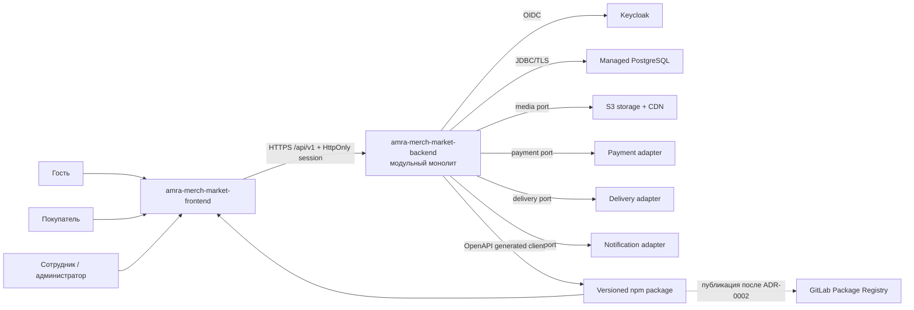

# Системный контекст «Амра Шоп»

Статус: утверждённый baseline.

Обновлено: 19 августа 2026 года.

## Назначение системы

`amra-merch-market-backend` предоставляет API интернет-магазина «Амра Шоп» для публичной витрины, покупателей, гостей и административных сотрудников. Backend владеет торговыми правилами, состоянием каталога, остатками, корзинами, ценами, заказами и аудитом.

Frontend `amra-merch-market-frontend` является отдельным проектом и получает типизированный клиент из versioned OpenAPI specification.

## Участники

| Участник | Основные сценарии | Уровень доверия |
| --- | --- | --- |
| Гость | Каталог, поиск, избранное, корзина, guest checkout, просмотр заказа по scoped token | Недоверенный внешний клиент |
| Покупатель | Профиль, адреса, избранное, корзина, заказы, отмены и возвраты | Аутентифицированный внешний клиент |
| Сотрудник | Управление разрешённой областью каталога, склада, заказов или поддержки | Привилегированный пользователь с ограниченными permissions |
| Администратор | Управление системой и ролями в пределах admin API | Привилегированный пользователь с обязательной MFA |
| Frontend | UI и локализация; вызывает только опубликованный HTTP API | Публичный клиент, не получает доверия сам по себе |

## Внешние системы

| Система | Назначение | Интеграционный контракт |
| --- | --- | --- |
| Keycloak | OIDC identity, MFA и authentication claims | OIDC; отдельная DB и lifecycle |
| PostgreSQL | Source of truth для business state, sessions и outbox | JDBC/TLS; Flyway migrations |
| S3-compatible storage + CDN | Product media и производные размеры | Port/adapter; presigned upload |
| Payment provider | Оплата и refund | В MVP controllable fake adapter; real provider позднее |
| Delivery provider | Расчёт/создание shipment/tracking | В MVP controllable fake adapter |
| Notification provider | Email/другие уведомления | В MVP fake adapter + fake inbox; async через outbox |
| GitLab | CI, package registry и container registry | Build/release infrastructure; activation отложена по ADR-0002 |
| Frontend npm consumer | Использует generated TypeScript client | Локальный package artifact; затем GitLab Package Registry |

## Контекстная схема

## Trust boundaries

1. Browser и любой HTTP caller недоверен; authorization выполняется для каждого use case на backend.
2. Frontend не хранит OIDC tokens и не является security boundary.
3. Keycloak подтверждает identity, но business permissions и resource authorization проверяет backend.
4. Admin API требует соответствующих permissions и MFA claim; все изменения аудируются.
5. Webhooks недоверены до проверки signature, timestamp и replay protection.
6. PostgreSQL является source of truth; caches, outbox consumers и providers не могут самостоятельно определять stock/order state.
7. PII, session identifiers и secrets не пересекают telemetry boundary.

## System boundary и ownership

Backend владеет:

- catalog/category/product/SKU lifecycle;
- inventory balance, movement ledger и reservations;
- customer profile, anonymous profile, favorites и cart;
- pricing, promotions и immutable order calculations;
- order/return state machines и audit;
- idempotency, sessions, outbox и provider integration state.

Backend не владеет:

- passwords, MFA factors и recovery credentials Keycloak;
- binary media objects;
- card data и provider-internal payment processing;
- delivery provider routing internals;
- UI localization и presentation state.

## Ключевые quality attributes

- Availability target: 99.9%.
- RPO ≤5 минут; RTO ≤30 минут.
- Initial sizing: до 50 RPS peak и 10 000 daily visitors.
- Горизонтальное масштабирование stateless application instances.
- Strong consistency для stock reservation и order confirmation.
- Backward-compatible `/api/v1` и reproducible immutable releases.

## Явные ограничения baseline

- Один storefront и одна active currency RUB.
- Один warehouse в MVP, но модель допускает несколько.
- Одна shipment на order в MVP.
- Нет negative stock, preorder, cache, broker, feature flags и real external providers.
- Production orchestrator и Secret Manager выбираются перед production-readiness stage.

## Связанные документы

- `docs/ENGINEERING_CHARTER.md`
- `docs/DECISION_REGISTER.md`
- `docs/IMPLEMENTATION_PLAN.md`
- `docs/adr/0001-modular-monolith.md`
- `docs/adr/0002-defer-gitlab-activation.md`
- `docs/adr/0003-openapi-contract-toolchain.md`
