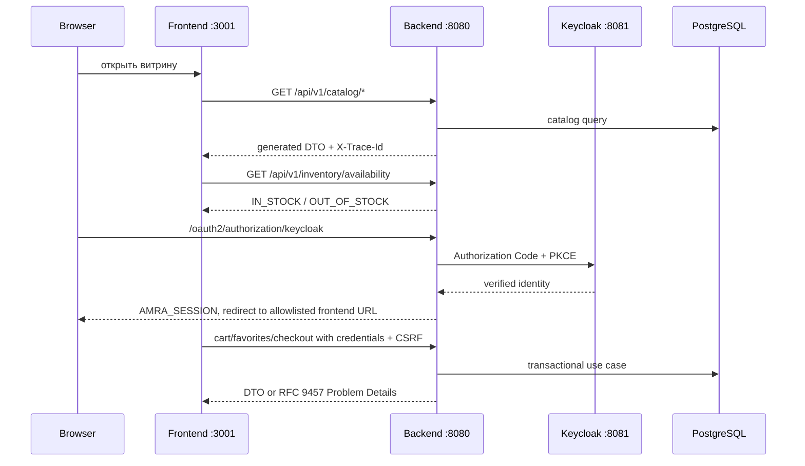

# План интеграции frontend и backend

Статус: проект плана, ожидает утверждения владельцем.

Обновлено: 19 августа 2026 года.

## 1. Цель

Последовательно заменить демонстрационные данные и `localStorage` в `amra-merch-market-frontend` на versioned backend contracts из `amra-merch-market-backend`, сохранив утверждённый дизайн и получив воспроизводимый локальный магазин:

- категории, поиск, карточки и детали приходят из backend;
- доступность варианта проверяется Inventory;
- login/session, favorites, cart и profile работают для guest и account;
- цена, скидка и итог вычисляются backend;
- checkout создаёт заказ, а кабинет показывает реальные заказы и историю;
- локальные payment/delivery/notification используют управляемые fake adapters;
- весь stack поднимается по документированному сценарию и проверяется end-to-end.

План не объединяет репозитории и не переносит business persistence во frontend/Sites D1. Backend остаётся единственным источником истины для server-owned data.

## 2. Фактическая готовность

| Пользовательская поверхность | Frontend сейчас | Backend сейчас | Что блокирует полноценную работу |
| --- | --- | --- | --- |
| Хедер, мегабар, главная, футер | дизайн и interactions готовы | editorial catalog primitives готовы | API mapping и local data seed |
| Категории, list, detail, pagination | fixtures в React | Catalog API готов | generated client, media fixtures, замена data source |
| Поиск | только иконка | catalog `q` готов | search UI, URL state и error/loading states |
| Размер/цвет/вариант | локальная упрощённая модель | variants/attributes готовы | единая variant selection model |
| Наличие | не подключено | batch Inventory availability готов | batch composition в frontend и stock seed |
| Login/session/logout | account demo | OIDC/JDBC session готов частично для integration | local users, safe return URL, logout в OpenAPI |
| Favorites/cart | `localStorage` | этап 9 не реализован | Customer/Favorites/Cart vertical slice |
| Profile/addresses | demo | этап 9 не реализован | Customer contracts и persistence |
| Prices/promotions/Sale | статические числа | этап 10 не реализован | Pricing vertical slice |
| Checkout/orders/history | UI/demo | этап 11 не реализован | Ordering/outbox/fake payment flow |
| Returns/provider status | отсутствует | этап 12 не реализован | Returns и integration ports |

Следовательно, Catalog и Inventory можно подключить раньше, но критерий «сайтом можно полноценно пользоваться» закрывается только после этапов 9–12 и соответствующих frontend slices.

## 3. Неподвижные границы

1. Canonical HTTP contract находится только в backend `src/main/openapi`.
2. Java transport и TypeScript client генерируются; generated code не редактируется вручную.
3. Frontend не создаёт независимые копии API DTO и не хранит server-owned cart/order/profile в D1 или `localStorage`.
4. Browser использует backend-managed `AMRA_SESSION` с `credentials: include`; OIDC tokens недоступны JavaScript.
5. Unsafe browser requests передают `AMRA_CSRF` как `X-AMRA-CSRF`.
6. Backend возвращает stable RFC 9457 codes; frontend локализует сообщения и сохраняет `traceId` для диагностики.
7. Backend stages 9–12 остаются последовательными gates. Frontend integration не подменяет отсутствующий backend fixtures или незащищёнными временными endpoints.
8. Production platform, ingress, object storage, Secret Manager и real providers этим планом не выбираются.

## 4. Целевая локальная топология

| Компонент | Адрес | Назначение |
| --- | --- | --- |
| Frontend | `http://localhost:3001` | Vinext/Sites local dev server |
| Backend | `http://localhost:8080` | Spring MVC `/api/v1` и OIDC entrypoint |
| Keycloak | `http://localhost:8081` | local realm `amra-shop` |
| Application PostgreSQL | `localhost:5432` | Flyway schema и runtime data |
| Keycloak PostgreSQL | только Compose network | identity data |
| Local media fixture | адрес определяется до блока 4 | delivery URLs для seeded media без выбора production storage |

Для local development frontend обращается к абсолютному configurable API base URL `http://localhost:8080/api/v1`; backend разрешает exact origin `http://localhost:3001` и credentials. Production routing рассматривается отдельно после выбора platform; local решение не объявляется production ingress policy.

## 5. Блоки реализации

Каждый блок выполняется в отдельной short-lived branch соответствующего репозитория, содержит документацию и завершается своим gate. Backend и frontend commits не маскируются одним общим commit: связь фиксируется contract version/spec checksum.

### Блок 0. Утверждение integration decisions

- утвердить этот план;
- утвердить local identity bootstrap без committed passwords;
- утвердить local demo-data bootstrap через application/admin contracts, не SQL/Flyway seed;
- утвердить local media fixture approach без выбора production object storage;
- решить судьбу несовместимого `amra-shop-state-v1`: рекомендуемый вариант — явный одноразовый сброс demo-state, а не неоднозначный mapping по display name;
- отдельно подтвердить auth model для будущего hosted Sites: local Keycloak уже выбран, но hosted external-identity path нельзя предполагать без проверки platform boundary;
- выбрать browser E2E runner отдельным решением, не добавляя библиотеку молча.

Gate: нет открытых решений, которые меняют contract, identity или data ownership.

### Блок 1. Синхронизация межрепозиторного контекста

Backend branch: documentation branch этого плана. Frontend branch: `feature/backend-integration-context` после разбора текущего dirty tree.

- убрать из frontend docs утверждения, что backend ещё не существует;
- записать фактические Java/Spring/PostgreSQL/Keycloak/OpenAPI boundaries;
- отметить, что frontend всё ещё работает на fixtures и ещё не интегрирован;
- добавить ссылку на этот план и backend handoff docs;
- зафиксировать completed/next/pending status одинаково в обоих проектах;
- заменить два устаревших starter-skeleton tests на assertions текущего storefront;
- провести отдельный dependency audit/upgrade для 20 найденных npm findings без `audit fix --force` и подтвердить совместимость Vinext/Sites build.

Gate: новый разработчик получает один непротиворечивый ответ о текущем состоянии из любого репозитория; frontend build, storefront tests и принятый supply-chain threshold зелёные.

### Блок 2. Contract delivery и frontend API boundary

Backend:

- добавить logout в OpenAPI и contract tests;
- зафиксировать login entrypoint/return-target behavior и безопасный allowlist;
- продолжить выпуск reproducible TypeScript source artifact;
- добавить manifest с API version и spec/artifact SHA-256.

Frontend:

- добавить детерминированную команду синхронизации generated client из backend artifact;
- хранить generated output отдельно и запрещать ручной drift;
- закрепить API base URL в `.env.example`, не в component code;
- создать один API composition boundary для configuration, credentials, CSRF, Problem Details и trace ID;
- добавить contract smoke, доказывающий совместимость закреплённого frontend TypeScript.

До GitLab Package Registry используется локальный reproducible artifact. Публикация npm package остаётся deferred gate ADR-0002.

Gate: frontend build использует generated client; ручных fetch DTO и незадокументированных API endpoints нет.

### Блок 3. Воспроизводимый local stack

- сохранить backend Compose владельцем PostgreSQL и Keycloak infrastructure;
- добавить проверку prerequisites: JDK 25, Node.js 22.13+, Docker и свободные configured ports;
- документировать создание ignored `.env` из обоих `.env.example` без реальных секретов;
- добавить readiness checks для PostgreSQL, Keycloak, backend health/API root и frontend route;
- сначала поддержать ясный multi-terminal workflow; единая команда добавляется только если остаётся прозрачной и корректно завершает дочерние процессы;
- описать reset отдельно от start: удаление volumes никогда не должно быть скрытым действием обычного запуска.

Целевой ручной workflow после реализации:

```shell
# backend terminal 1
cp .env.example .env
docker compose up -d postgres keycloak-postgres keycloak
set -a && . ./.env && set +a
./gradlew bootRun

# frontend terminal 2
npm ci
cp .env.example .env.local
npm run dev
```

Эти команды ещё не являются полным сегодняшним workflow: frontend env/client, identity bootstrap и seed появляются в следующих блоках.

Gate: fresh local checkout поднимает infrastructure и оба приложения без ручного редактирования source files.

### Блок 4. Local identity, data и media bootstrap

- создать idempotent local-only identity provisioning через Keycloak Admin API; test credentials приходят из ignored environment и не попадают в realm JSON/Git;
- создать минимум customer, catalog manager и warehouse manager identities с verified email; MFA acceptance не ослаблять;
- создать idempotent catalog/inventory seed runner через опубликованные admin APIs с ETag, CSRF и idempotency semantics;
- seed должен создать категории, collections, products, variants, media metadata и stock для репрезентативных frontend flows;
- поднять local media fixture delivery и настроить `AMRA_CATALOG_MEDIA_BASE_URL`;
- reset/seed должны быть явными отдельными командами и не использовать production Flyway migrations для demo content.

Gate: после чистого старта storefront APIs возвращают непустой, детерминированный набор, а повтор seed не создаёт дублей.

### Блок 5. Live Catalog, Search и Inventory во frontend

- заменить hardcoded мегабар на `getCatalogCategories`;
- заменить home/category grids на paged `getCatalogProducts`;
- связать New, collections, category, section, filter, sort и search с URL state и contract parameters;
- открывать detail через canonical slug и `getCatalogProduct`;
- построить size/color selection на stable variant/attribute codes;
- запрашивать availability batch на видимые/выбранные variants без N+1;
- отдельно обрабатывать loading, empty, 404, redirect и transport/problem states;
- сохранить текущую модальную карточку, дизайн, доступность и кликабельность;
- не подделывать цену catalog fields: до Pricing разрешён только явно обозначенный transitional UI, который не проходит final storefront gate.

Gate: категории, карточки, detail, search и availability не зависят от product fixtures; frontend build и integration scenarios зелёные.

### Блок 6. Customer, Favorites и Cart — backend этап 9 + frontend slice

Backend сначала реализует утверждённый этап 9 contract-first. Затем frontend:

- показывает anonymous/authenticated session state;
- запускает login, возвращается на безопасный frontend URL и выполняет contract logout;
- использует server anonymous profile/guest cookie;
- заменяет local favorites и cart на generated API;
- сохраняет variant ID, количество и server version/ETag, а не display-only product ID;
- выполняет deterministic guest→account merge;
- реализует profile и addresses;
- показывает stock/price change notices по backend codes;
- удаляет `localStorage` как source of truth; несовместимый demo key обрабатывает утверждённой одноразовой migration policy.

Gate: guest/auth state переживает frontend/backend restart, одинаково работает на нескольких backend instances и изолировано между пользователями.

### Блок 7. Pricing и Promotions — backend этап 10 + frontend slice

- подключить backend price result для list/detail/cart;
- удалить статические цены и локальный расчёт итогов;
- показывать base/current price, применённое предложение и объяснимое изменение цены;
- связать Sale и promotional modules только с реальными promotion/collection data;
- перепроверять cart перед переходом к checkout.

Gate: один backend pricing input даёт одинаковые карточку, cart и checkout preview; frontend не вычисляет business price.

### Блок 8. Ordering и Checkout — backend этап 11 + frontend slice

- реализовать checkout state flow через idempotent commands;
- показывать адрес, итоговый snapshot, reservation/payment state и recoverable failures;
- fake payment/delivery остаются управляемыми local adapters;
- заменить account demo orders/history на owner-scoped API;
- корректно обрабатывать retry, duplicate submit, expired reservation и invalid transition;
- не хранить order truth в browser state.

Gate: customer и guest проходят happy path от товара до order history; повтор submit не создаёт duplicate order.

### Блок 9. Returns и integration ports — backend этап 12 + frontend slice

- добавить return request/status UI для разрешённых order/lines;
- отобразить fake delivery/payment/notification outcomes;
- проверить webhook duplicate/replay/failure scenarios на backend;
- не подключать real provider без отдельного выбора и ADR.

Gate: local success/failure/timeout/replay воспроизводимы без внешнего vendor.

### Блок 10. Full-stack acceptance и developer workflow

- автоматизировать contract, backend integration, frontend build и browser E2E critical journeys;
- проверить anonymous catalog, login/logout, favorites, cart merge, price change, checkout, order history и return;
- проверить cookie/CORS/CSRF/trace behavior на реальном local HTTP stack;
- добавить deterministic smoke data lifecycle;
- документировать start, stop, reset, seed, test, common failures и безопасное удаление local data;
- обновить developer guides и обе status pages в тех же branches;
- только после этого назвать local storefront полноценным.

Gate: новый разработчик по одному guide поднимает чистый stack и проходит critical journey без знания внутренней реализации.

## 6. Целевой runtime flow



## 7. Межрепозиторный Git-ритм

1. Backend contract/invariant меняется первым и проходит compatibility gates.
2. Backend выпускает versioned generated-client artifact и checksum.
3. Frontend отдельным commit обновляет только generated client + manifest.
4. Следующий frontend commit меняет adapter/composition behavior.
5. Затем идут UI states/tests/docs без смешивания unrelated design changes.
6. Integration acceptance записывает обе commit IDs и API artifact checksum.
7. Merge каждого репозитория независим и обратим; frontend не требует непопавший в `main` backend contract.

## 8. Definition of Done полноценного локального сайта

- clean start создаёт schema только Flyway migrations и затем явно загружает local fixtures;
- frontend не содержит production product/profile/order fixtures;
- category/list/detail/search/filter/pagination работают через API;
- availability, prices, favorites, cart, profile и addresses приходят из backend;
- login/logout/session/CSRF работают из браузера на `localhost:3001`;
- checkout создаёт idempotent order с inventory reservation и immutable snapshots;
- account показывает реальные owner-scoped orders/history;
- fake integration failures воспроизводимы и не нарушают stock/order invariants;
- restart не теряет PostgreSQL state; reset всегда явный;
- critical full-stack scenarios автоматизированы;
- README и guides обоих проектов содержат одинаковый local topology и troubleshooting;
- GitLab/production-only gaps остаются явно помеченными и не смешиваются с local-ready status.

## 9. Не входит в утверждение этого плана

- запуск этапа 9 или изменение frontend application code;
- выбор production hosting/orchestrator/ingress;
- выбор production object storage/CDN и Secret Manager;
- подключение real payment, delivery или notification provider;
- публикация generated npm package/GitLab activation;
- публичный deployment Sites и окончательное решение совместимости hosted Sites identity с внешним Keycloak;
- мобильный редизайн.

Следующее действие после ревью: владелец утверждает блок 0 и порядок блоков. После этого работа начинается с отдельной актуализации frontend-контекста и contract delivery, а не сразу с переписывания компонентов.
